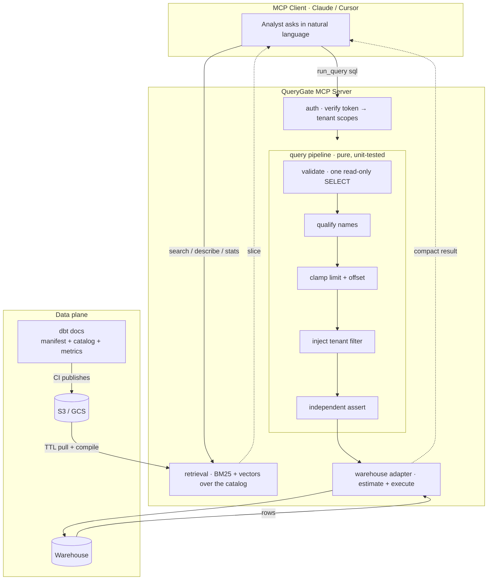

# QueryGate

[](https://github.com/Arif-krepkiy/querygate/actions/workflows/ci.yml)
&nbsp;
&nbsp;

**Let an LLM answer data questions in SQL, without letting it near your data.**

QueryGate is an MCP server that sits between an AI agent and your warehouse.
The agent writes the SQL. QueryGate validates it, scopes it to the caller's
tenant, caps its cost, runs it read-only, and returns a compact result.

It is meant to be picked up and adapted, not deployed as-is. Every part a DWH
team would need to change is a seam: the warehouse adapter, the auth provider,
the catalog source, the vector store. The demo stack (Postgres, dbt, Keycloak)
is there so a team can watch the whole thing work end to end before swapping
its own pieces in. See [Using this as a template](#using-this-as-a-template).

The model is good at writing queries. It cannot be trusted to decide who may
see what. Those are different jobs, and only one of them can be delegated.

```
Analyst:  "How much completed revenue do we have?"

tok_acme    →  $55,952.59
tok_globex  →  $62,841.34
tok_multi   →  $118,793.93     ← exactly the sum. No bleed, no double-count.
```

Same question, same SQL, three callers. There is no prompt that makes
`tok_acme` return Globex's revenue: the tenant filter is injected into the
SQL *after* the model is done and independently re-verified *before* execution.

---

## The problem

Handing an agent a database connection takes ten minutes. Everything that makes
it safe is the actual work:

- **An LLM will happily read the wrong tenant's data** if nothing stops it. A
  system-prompt instruction is not a control, it's a polite request.
- **An LLM will happily scan your whole warehouse.** No cost intuition, no
  sense of what a missing partition filter costs.
- **An LLM guesses when it can't see.** Wrong join keys silently inflate row
  counts. Invented filter values return nothing. Both look like valid answers.

## What you get

| Guarantee | How |
|---|---|
| **Row-level security that can't be prompted away** | Tenant predicate injected into the SQL AST, then re-proved by an independent parse. Fail-closed. |
| **Column-level security** | PII masked in the AST, and masked columns are barred from predicates so they can't be probed. |
| **Metric pushdown** | Ask for `completed_revenue` by name; the server compiles the human-owned definition to SQL. |
| **Read-only, always** | Single `SELECT` enforced at the AST *and* by a read-only warehouse principal. |
| **Cost ceiling** | `EXPLAIN` before execute; refuse over budget with guidance. Row limits clamped server-side. |
| **Static guardrails** | Accidental cartesian products refused on shape alone; partition filters enforceable before the engine plans anything. |
| **Per-caller rate limiting** | Token bucket in a Redis Lua script. Heavier tools cost more tokens. |
| **Server-side retrieval** | Agent gets a *slice* per question, never a copy of your schema. BM25 + optional vectors. |
| **Human-owned metrics** | dbt MetricFlow definitions are handed to the agent as authoritative, so a business term means one thing for everyone. |
| **Context engineering** | Declared joins, data profiling, pagination, so the agent stops guessing. |
| **Refusals that teach** | Every rejection names the near miss: the column you meant, or the table it actually lives on, with the join keys. |
| **Engine-agnostic** | Postgres, DuckDB, BigQuery and Snowflake ship; Trino is one module more. |
| **Pluggable auth** | OIDC/Keycloak with strict JWT validation, or static tokens for the demo. |
| **Observability** | OTel spans + Prometheus metrics, with SQL and tenant IDs redacted by default. |
| **Warehouse-enforced mode** | Or delegate row security to the engine, so the query runs as the caller's own warehouse role. [Design notes](docs/warehouse-enforced-governance.md). |
| **Certified-only callers** | A role that may read signed-off metrics and nothing else: no ad-hoc SQL, no uncertified number. |

## Try it

```bash
git clone https://github.com/Arif-krepkiy/querygate && cd querygate
docker compose up --build
```

Brings up Postgres, builds a multi-tenant warehouse with dbt (3 tenants,
~730 orders), starts the MCP server on `http://localhost:8765/mcp`. Point any
MCP client at it:

```jsonc
{
  "mcpServers": {
    "querygate": {
      "type": "http",
      "url": "http://localhost:8765/mcp",
      "headers": { "Authorization": "Bearer tok_acme" }
    }
  }
}
```

Then ask in plain language: *"How much completed revenue do we have, by
region?"* · *"Which customers haven't ordered recently?"* · *"What does the
Enterprise plan cost?"*

**Now swap `tok_acme` for `tok_globex` and ask the same thing.** Different
numbers, every time, no matter how the question is phrased.

Or run the isolation demo as a script. It speaks MCP directly, so what you see
is the server's guarantee rather than a model's cooperation (no API key needed):

```bash
uv run python examples/isolation_demo.py
```
```
tok_acme     (Acme only  ) → $   55,952.59
tok_globex   (Globex only) → $   62,841.34
tok_multi    (both       ) → $  118,793.93
acme + globex = $118,793.93   equals tok_multi: True
```

To watch an agent actually work, discovering the schema and then writing the
SQL, [`examples/agent_loop.py`](examples/agent_loop.py) is ~40 lines and holds
no prompt of its own (the server ships its own workflow guidance).

No Docker? DuckDB runs the whole pipeline in-process:

```bash
uv sync --extra duckdb
QG_WAREHOUSE=duckdb uv run pytest tests/querygate/test_duckdb_warehouse.py -v
```

## How the row-level security actually works

Every query runs a pure pipeline before anything touches the warehouse:

```
validate → guard → qualify → limit → offset → govern → assert → estimate → execute
```

The model writes this:

```sql
SELECT region, sum(amount) FROM customer_orders GROUP BY region
```

QueryGate executes this:

```sql
SELECT region, SUM(amount)
FROM "analytics"."customer_orders"
WHERE customer_orders.tenant_id = ANY(%(qg_tenant_scopes)s)   -- injected
GROUP BY region
LIMIT 100                                                      -- clamped
```

Three things carry the guarantee:

1. **Tenant IDs are bound parameters.** They never appear in the SQL text; the
   driver binds them at execution.
2. **Every scope is walked:** joins, subqueries, CTEs. A governed table three
   levels deep inside a `WITH` still gets filtered; a public table in the same
   query stays untouched.
3. **An independent assert re-derives the proof** from the final SQL text. Not
   a flag set by the injector, but a separate re-parse that demands the exact
   predicate shape on every governed table. A filter that's missing, `OR`-ed
   with a tautology, or bound to the wrong parameter is rejected before
   execution.

**Fail-closed:** a governed table with an empty tenant scope doesn't return
zero rows, it refuses to run. Absence of permission is not permission.

**Where the guarantee ends.** The assert is independent of the injector, but
not of the parser: both read the SQL through sqlglot. The whole argument
therefore assumes sqlglot resolves scopes the same way the target engine does.
A dialect construct it parses differently is a construct where the predicate
could land in the wrong scope, and re-parsing with the same library will not
catch it. That is the boundary of the threat model, and it is why the
inject-and-assert layer is best treated as defence in depth over native row
access policies rather than a replacement for them (see
[Portability](#design-notes) for wiring it that way).

### Watch it happen

Don't take the diff above on trust; trace any query through the real pipeline:

```bash
uv run python examples/pipeline_trace.py
uv run python examples/pipeline_trace.py "SELECT customer_name FROM customer_orders"
```

```
The agent wrote:
    SELECT customer_name, amount FROM customer_orders ORDER BY amount DESC
  ✓ validate  Parsed; every table and column resolved against the catalog.
  ✓ guard     Shape checked: no unconditioned join, no unpruned partition.

▸ qualify  Model names replaced with real schema-qualified relations.
    SELECT customer_name, amount FROM «"analytics"."customer_orders"» ORDER BY amount DESC

▸ limit  Row limit clamped to the server maximum (100).
    … ORDER BY amount DESC« LIMIT 100»

▸ mask  Columns the catalog marks as PII wrapped in their mask.
    SELECT« MD5(CAST(customer_name AS TEXT)) AS» customer_name, amount FROM …

▸ govern  Tenant predicate injected into every governed scope.
    … "analytics"."customer_orders" «WHERE customer_orders.tenant_id = ANY(%(qg_tenant_scopes)s) »ORDER BY …
  ✓ assert    Re-parsed from scratch; both predicates re-proved on the final text.

✓ EXECUTED  tenant IDs bound as parameters, never in the text
    qg_tenant_scopes = ['acme']
```

The recorder is threaded through the same `_pipeline` that `run_query` calls,
so there is no second implementation to drift, and a test asserts the traced SQL
is byte-identical to what executes. Stages that rewrote nothing still get named:
"governance did nothing to this public table" is a claim, not an omission. The
tour also traces two refusals, which is where the output earns its keep.

Row-level security is one 130-line module of pure functions
([`governance.py`](src/querygate/query/governance.py)) plus the AST helpers it
shares with validation. The security-critical surface is small enough to read in
one sitting and test exhaustively; its only third-party import is sqlglot and it
performs no I/O at all. See
[`test_governance.py`](tests/querygate/test_governance.py) for the matrix:
aliases, joins, subqueries, CTE shadowing, and the adversarial asserts.

## Is this right for your warehouse?

| You have | Verdict |
|---|---|
| A multi-tenant warehouse with a tenant column | **Yes.** The core use case: predicate injection, ready to go |
| Native RLS (Snowflake row access policies, Postgres RLS) | **Yes, and keep it.** The server binds session context and verifies policy coverage instead |
| A lakehouse (S3 + Trino/Iceberg) | **Yes,** once you write the Trino adapter. The server talks to the engine, never to the files |
| dbt in your stack | **Best fit.** The catalog compiles straight from `dbt docs generate`; metrics from MetricFlow |
| No dbt | **Partly.** Use `information_schema` plus a small YAML overlay, or a static bundle |
| Single-tenant, all data public to all staff | **Partly.** You still get read-only, cost caps, retrieval and rate limiting, just not the headline feature |
| You want the agent to **write** data | **No.** Out of scope by design. Read-only is a guarantee here, not a setting |

## Using this as a template

This started as a reference implementation for DWH teams rather than a product,
and the layout reflects that. Nothing in the demo stack is load-bearing: it
exists so you can run the whole path once, see what each control actually does,
and then replace the parts that are yours.

What a team typically changes, in the order it usually happens:

| Step | Where | What it involves |
|---|---|---|
| 1. Point it at your warehouse | `warehouse/` | Two coroutines, `estimate` and `execute`. Postgres and DuckDB are the worked examples. See [Writing an adapter](#writing-an-adapter). |
| 2. Point it at your catalog | `QG_CATALOG_S3_URI` | If you run dbt, this is the artifacts your CI already publishes. Without dbt, compile a bundle in the shape of [`sample_catalog.json`](src/querygate/references/sample_catalog.json). |
| 3. Wire your identity provider | `auth/` | Implement a `TokenVerifier` that returns a `QGAccessToken`, or set `QG_AUTH_PROVIDER=oidc` and map the tenancy claim. |
| 4. Decide the tenancy model | `QG_TENANT_COLUMN` | Or drop predicate injection entirely and let native row access policies do it, keeping the pipeline for cost, masking and retrieval. |
| 5. Tune the limits | `.env` | Row caps, plan-cost ceiling, rate limits, which columns are masked. |

The pieces worth reading before adapting anything are `query/` (the whole
security argument, pure and I/O-free) and `tests/querygate/test_governance.py`
(what the argument is actually asserted to mean). If your team changes the
governance layer, that test file is the thing to change first and the code
second.

The demo warehouse is deliberately small and boring so the diffs stay legible.
Swap `dbt/` for your own project and the seeds go away with it.

## Architecture



**Tools the agent sees:** `search_catalog`, `describe_model`,
`get_filter_values`, `get_table_stats`, `get_metric`, `run_query`,
`reload_catalog`. Plus
four **MCP prompts** a user can pick from their client (`explore_domain`,
`answer_question`, `data_dictionary`, `sanity_check`), because the hardest
message in a text-to-SQL session is usually the first one.

Everything else is invisible to the model and non-negotiable.

---

## Design notes

<details>
<summary><b>Context engineering: an LLM client needs a different API than a human</b></summary>

A human analyst explores by looking. An agent can't, so it guesses, and the
guesses fail quietly. Three behaviours remove them:

- **Declared joins.** `describe_model` returns the join keys the dbt project
  actually declares (parsed from its `relationships` tests). Guessing which
  columns relate two tables is the most common way generated SQL goes wrong,
  because a plausible-but-wrong join silently fans out row counts instead of
  erroring.
- **Data profiling.** `get_table_stats` returns row count, null fraction,
  cardinality and ranges per column, plus sample rows: a few hundred tokens
  instead of a few thousand rows. It runs governed, so a profile only ever
  describes rows the caller may see.
- **Pagination.** A truncated result returns `next_cursor`. Cursors are opaque
  and stateless, and carry a fingerprint of the query, so replaying one against
  different SQL is refused rather than quietly returning the wrong page.

Plus `get_filter_values`: real values from the column, so the agent filters on
facts instead of inventing `status = 'complete'` when the data says
`'completed'`.

And when it does get something wrong, the refusal is written to be actionable
rather than merely correct. An agent told `Unknown table 'orders'` goes back and
searches again: a round trip, more tokens, and a fair chance of the same
mistake. So every rejection names the near miss:

```
Query references column(s) not in the catalog: o.amont.
  → Did you mean 'amount'?

Query references column(s) not in the catalog: o.is_active.
  → 'is_active' exists on 'active_customers'
    (join on customer_orders.customer_id = active_customers.customer_id)
```

Two different lookups, because they're two different mistakes. A misremembered
name is a string-distance problem. A *right column on the wrong table* is an
exact lookup, and since the catalog already knows the declared joins, the
error can hand back the recipe instead of just the diagnosis. Below a
similarity cutoff nothing is suggested at all: a confidently wrong hint is
worse than none, because the agent will take it.
</details>

<details>
<summary><b>Column-level security, and the oracle that makes naive masking useless</b></summary>

Row-level security answers *which rows*. This answers *which columns*: an Acme
analyst is entitled to Acme's rows and may still have no business reading the
customer names inside them.

Columns marked in the catalog (from dbt column `meta`, never inferred from
names, since `email_preference` isn't PII and a regex would say otherwise) are
rewritten in the projection:

```sql
SELECT customer_name FROM customer_orders
-- becomes
SELECT MD5(CAST(customer_name AS TEXT)) AS customer_name FROM ...
```

Equal values produce equal hashes, so `count(DISTINCT customer_name)` still
returns the right answer. The analytical value survives; the identity doesn't.

**The part that's easy to get wrong.** Masking only the SELECT list is theatre.
If a masked column can still appear in a predicate, the caller has an oracle:

```sql
SELECT count(*) FROM customers WHERE customer_name = 'Alice Smith'
```

Run that a few hundred times and you've read the column you weren't allowed to
read, one guess at a time, while every returned value stayed masked. So a
masked column is confined to the SELECT list: WHERE, JOIN, GROUP BY, ORDER BY
and HAVING are all refused, with an error that explains why.

`SELECT *` was the other trap: a `Star` node isn't a `Column`, so a rewrite
that walks columns never sees the masked one and the laziest possible query
defeats the whole control. Wildcards over a table with masked columns are
expanded from the catalog first. That leak was caught by a test, which is the
argument for writing the paranoid ones.

A principal holding `QG_PII_UNMASK_ROLE` reads in the clear, and still only
their own tenant's rows. The two controls are independent by design.
</details>

<details>
<summary><b>Static guardrails: what a cost estimate is too late to catch</b></summary>

`EXPLAIN` is a good cost ceiling and a bad early-warning system: by the time it
answers, the engine has planned the query, and on BigQuery the plan *is* the
bill. Two mistakes are worth catching earlier, on shape alone.

**Accidental cartesian products.** `FROM orders o, plans p` plans instantly and
costs nothing to estimate, then returns the product of both row counts. It's
the one failure mode where a correct query and a catastrophic one look
identical to the optimiser, and an LLM writes it by simply forgetting the `ON`.
The check refuses any join between two catalog tables that carries no real
condition, including `ON 1 = 1` and `ON a.x = a.y`, which are cross joins in
disguise. Unqualified column names get the benefit of the doubt: guessing which
table a bare name belongs to is the resolver's job, not a guardrail's.

**Missing partition filters.** On a partitioned table, a query with no range
filter reads every partition. The plan is valid either way, so a cost ceiling
only notices once the engine has already decided to scan five years. The
catalog reads `partition_by` from dbt and always tells the agent which column
prunes: `describe_model` surfaces it, so the agent can write a cheap query
whether or not the check is on.

Enforcement is opt-in (`QG_REQUIRE_PARTITION_FILTER`), and off by default on
purpose: Postgres and DuckDB barely care, and a guardrail that fires on the
local demo just teaches people to switch it off. Turn it on where partitions
cost money. The refusal names the column and shows the shape of a fix, because
`IS NOT NULL` is exactly what a model reaches for when it's been told to filter
and doesn't know the range, and it prunes nothing:

```
'customer_orders' is partitioned by 'order_date'; without a range filter on it
the query scans every partition. Add a condition such as
"order_date >= DATE '2024-01-01'". A bare IS NOT NULL does not narrow the scan.
```

Both are grounding errors, not governance errors. The query isn't dangerous,
it's wrong, and the message is written so the agent can fix it and retry
without a human in the loop.
</details>

<details>
<summary><b>Caching is a security surface, not an optimisation</b></summary>

Two callers can send byte-identical SQL and legitimately be owed different
rows. A cache keyed on the query alone hands one tenant another's data
*without ever running their query*, neatly bypassing everything above.

So the key type makes it impossible to get wrong:

```python
@dataclass(frozen=True)
class CacheKey:
    namespace: str
    tenant_scopes: frozenset[str]   # required, no default
    parts: tuple[str, ...]
```

You cannot construct a key without answering "on whose behalf?". Scopes are
sorted and hashed with a separator, so a crafted column name can't collide with
someone else's scope. Tests assert it directly: same query + different tenant ⇒
different key, and a single-tenant caller never hits a multi-tenant entry.

What's cached is narrow: `get_filter_values` (repetitive, stable)
but **not** `run_query` (phrased differently every time, so poor hit rate
against a cross-tenant blast radius). BigQuery and Snowflake already cache
identical results for 24h, which makes an app-level query cache redundant there
anyway.
</details>

<details>
<summary><b>Rate limiting, and why it fails <i>open</i></b></summary>

An agent in a retry loop hits a warehouse harder than any human. A token bucket
runs entirely inside [one Lua script](src/querygate/ratelimit/scripts/token_bucket.lua),
so the refill-and-spend cycle is atomic across replicas: 50 concurrent calls
against a 3-token bucket allow exactly 3.

- **Token bucket, not fixed window.** A fixed window lets a caller spend a full
  quota at the end of one window and again at the start of the next.
- **Per-caller buckets** (principal / tenant / global), because a global counter would
  let one noisy tenant starve everyone.
- **Per-tool costs.** `run_query` reaches the warehouse and costs 5 tokens;
  `search_catalog` answers from memory and costs 1.

One deliberate asymmetry: the limiter **fails open**, governance **fails
closed**. Rate limiting protects availability; refusing every query because
Redis is unreachable trades a small risk for a certain outage. Confidentiality
gets the opposite default.
</details>

<details>
<summary><b>Retrieval, and where vectors live</b></summary>

`search_catalog` fuses BM25 (plus a glossary, so "money" reaches a model whose
text says "revenue") with optional embeddings, via Reciprocal Rank Fusion:
rank-based, so the two incomparable score scales don't need calibrating.

Embeddings are strictly additive: missing extra, failed model load, or
unreachable vector store all degrade to keyword-only and log it. A question
never goes unanswered because the semantic half is down.

Vectors sit behind a `VectorBackend` protocol. In-process (a normalised numpy
matrix) is the default and correct for most catalogs; 3k models × 384 dims is
~4.5 MB. **Qdrant** earns its place once the catalog outgrows the process,
replicas would otherwise re-embed the same data on every sync, or you want
metadata-filtered search pushed down. BM25 and the fusion always stay
in-process, which is what makes the swap invisible.
</details>

<details>
<summary><b>Human-owned metrics (dbt MetricFlow)</b></summary>

"Active customer" and "completed revenue" are defined once, by a person, in the
dbt semantic layer. `dbt parse` compiles them to `semantic_manifest.json`,
which QueryGate ingests.

Surfacing those definitions to the agent isn't enough on its own: it still
leaves the model to assemble the SQL, and that's where an agreed number quietly
becomes an approximation: a forgotten filter, a `sum` where the definition says
`count(distinct)`. So `get_metric` compiles the definition instead:

```
get_metric("completed_revenue", dimensions=["region"])
-- server writes:
SELECT "region", sum(amount) AS completed_revenue
FROM "analytics"."customer_orders"
WHERE status = 'completed'                       -- from the definition
  AND customer_orders.tenant_id = ANY(...)       -- from governance
GROUP BY "region"
```

The agent decides *what to ask for*; a person decided *what it means*; the
server is the only thing that turns the second into SQL. It still runs the full
governed pipeline, so a metric can't be used to sidestep row- or column-level
security.
</details>

<details>
<summary><b>Auth: Keycloak, or anything OIDC</b></summary>

The server is an OAuth2 *resource server*: it never mints tokens, it validates
what clients bring. `QG_AUTH_PROVIDER=oidc` turns on strict verification:
JWKS discovered from the issuer's well-known document (so a realm rename
doesn't silently break auth), issuer/audience/expiry enforced, and an
**asymmetric-only algorithm allow-list**.

That last one is not paranoia. Accepting `HS256` alongside `RS256` enables the
classic confusion attack: the attacker signs a token using the provider's
*public* key as an HMAC secret. There's a test that builds exactly that token
by hand and asserts rejection, next to `alg: none`, wrong issuer, wrong
audience, foreign key and expired.

Tenancy comes from a configurable dotted claim path (`tenant_ids`,
`resource_access.querygate.tenants`, …) because every provider puts it
somewhere different. A token with no tenant claim yields an empty scope set,
which the governance layer then treats as "may read nothing governed": the
fail-closed default rather than an accident.

Try it against a real IdP:

```bash
docker compose --profile full up      # includes Keycloak with a realm imported
```

Three users (`alice`/acme, `bob`/globex, `carol`/both+admin) with tenant
attributes already mapped, so the isolation demo runs against real tokens with no
console clicking.
</details>

<details>
<summary><b>Observability, and why traces are redacted</b></summary>

One OTel span and one set of Prometheus counters per tool call, wrapping
*outside* the error mapper so a governance rejection is recorded as an outcome
rather than lost. That rejection rate is arguably the most interesting signal
this server produces: a spike means either an attack or a broken tenant claim,
and you want to know which within minutes.

**Spans are redacted by default.** It is tempting to put the SQL and the
caller's tenant IDs in a trace, and that's exactly what you want while debugging.
It's also how a carefully governed query path leaks into a backend that has
none of this server's access controls: traces get shipped to a vendor, retained
for months, and read by people who were never granted warehouse access.

So spans carry structure: tool, outcome, table names, row counts, timings, and
the *count* of tenant scopes rather than their values. `QG_TRACE_SENSITIVE`
opts in, and is named so the choice is explicit.

Metrics are picked for what's worth alerting on here: outcome by kind,
duration, rows returned, and **response bytes**, the cheapest proxy for the
agent's context spend. An agent pulling 200 KB per call will blow its window no
matter how fast the query was.
</details>

<details>
<summary><b>Portability: what it takes to retarget</b></summary>

| Concern | Ships with | Swap by |
|---|---|---|
| **Warehouse** | Postgres, DuckDB | one module under `warehouse/` + a line in `_ADAPTERS` |
| **Row security** | injected predicate | keep the inject+assert contract, or move to native RLS / secure views |
| **Auth** | OIDC/Keycloak, static tokens | implement a `TokenVerifier` |
| **Catalog** | dbt docs, bundled sample | point `QG_CATALOG_S3_URI` at your dbt CI output |
| **Search** | BM25 + glossary | `--extra embeddings`, `--extra qdrant` |

Writing the DuckDB adapter immediately found a latent bug: QueryGate was
binding the tenant parameter even on public-table queries with no tenant
predicate. Postgres silently ignores an unused named parameter; DuckDB rejects
it. **A second adapter is a test for the first one.**
</details>

---

## Writing an adapter

The warehouse seam is two coroutines. To support ClickHouse, Snowflake, Trino
or anything else with a SQL dialect sqlglot knows:

```python
# src/querygate/warehouse/clickhouse.py
from querygate.warehouse.types import CostEstimate, QueryResult, WarehouseError

async def estimate(prepared) -> CostEstimate:
    """Pre-execution cost signal, compared against your configured ceiling."""
    ...

async def execute(prepared) -> QueryResult:
    """Run it. `prepared.sql` is already validated, governed and row-limited;
    `prepared.bind_params()` gives the parameters the SQL actually references."""
    ...
```

Then one line in [`warehouse/__init__.py`](src/querygate/warehouse/__init__.py):

```python
_ADAPTERS = {
    "postgres": "querygate.warehouse.postgres",
    "duckdb": "querygate.warehouse.duckdb_backend",
    "bigquery": "querygate.warehouse.bigquery",
    "snowflake": "querygate.warehouse.snowflake",
    "clickhouse": "querygate.warehouse.clickhouse",   # ← yours
}
```

One thing the cloud adapters had to add: the canonical predicate
`col = ANY(:param)` is Postgres syntax. BigQuery wants `IN UNNEST(@param)` and
Snowflake wants `ARRAY_CONTAINS(col::VARIANT, PARSE_JSON(:param))`, so
[`tenant_sql.py`](src/querygate/warehouse/tenant_sql.py) rewrites it at the last
hop and then re-proves its own output: the engine-form predicate count must
equal the canonical count it replaced, and no canonical form may survive. A
rewrite that dropped a predicate fails closed instead of running ungoverned.

Set `QG_WAREHOUSE=clickhouse` (and `QG_SQL_DIALECT` if the engine's sqlglot
dialect name differs). Nothing else changes: the pipeline, governance,
masking, catalog and tools are engine-agnostic.

Three things are worth getting right, and the DuckDB adapter is the worked
example for all three: **bind arrays the way your driver expects** (this is
where engines differ most), **map driver errors to safe messages** (engine
errors can echo values from the data), and **find the engine's real kill
switch**, because a cost estimate is advisory and a statement timeout or byte cap is not.

Copy [`test_duckdb_warehouse.py`](tests/querygate/test_duckdb_warehouse.py) and
point it at your engine; if those assertions pass, the adapter is correct.
PRs welcome.

## Development

```bash
uv sync                    # install (add --extra duckdb/redis/oidc/otel/qdrant as needed)
make test                  # unit tests, no infrastructure needed
make test-integration      # spins up Postgres, builds marts, runs end-to-end
make eval                  # retrieval hit@k over the golden question set
make lint
```

**Testing philosophy.** The security core is pure functions, so the governance
matrix runs with no warehouse at all: aliases, joins of two governed tables,
governed+public mixes, subqueries, CTE shadowing, empty scope, and the
adversarial asserts (filter missing, `OR`-ed with `1=1`, wrong parameter). CI
runs Postgres and Redis as services, so integration and Lua tests execute for
real rather than skipping.

**Evals** are a separate axis from tests: a golden set of plain analyst
questions with ground-truth answers computed from deterministic seeds.
Retrieval quality (hit@k) is offline and CI-friendly; answer quality is checked
by running an agent and comparing to recorded numbers. See
[`evals/questions.json`](evals/questions.json).

**Kubernetes.** There is a chart in
[`deploy/helm/querygate`](deploy/helm/querygate). It wires the configuration as
env, rolls pods when the ConfigMap changes, and fails readiness on SIGTERM so
the load balancer drains the pod before the process goes away.

## Known limitations

Worth knowing before this goes anywhere near production traffic.

- **No connection pooling.** [`_connect()`](src/querygate/warehouse/postgres.py)
  opens a fresh `psycopg` connection per call, and `run_query` connects twice:
  once for `EXPLAIN`, once to execute. That is fine for the demo and for a
  handful of analysts, and it is the first thing to fall over under concurrency.
  A pool (`psycopg_pool.AsyncConnectionPool`) held on the adapter is the fix;
  it is not in yet because the read-only session setup and `statement_timeout`
  need to move to a pool-level connection callback rather than being applied
  per connect.
- **The guarantee is only as good as sqlglot's parse.** Covered above under
  [How the row-level security actually works](#how-the-row-level-security-actually-works).
  For anything regulated, run inject-and-assert *over* native row access
  policies, not instead of them.
- **The cost ceiling is off unless you set it.** `QG_MAX_PLAN_COST` defaults to
  `0`, which disables it. The compose stack and `.env.example` set a real
  number; a bare `pip install` does not.
- **Masking is MD5, which is a pseudonymiser and not a secret.** Analytical
  value survives (equal values hash equal) but a low-cardinality column with a
  guessable domain, like customer names, does not survive a dictionary attack by
  someone who can see the hashes. For regulated data, swap in a keyed HMAC whose
  secret the query layer never returns.
- **The rate limiter fails open by default.** Deliberate, and the opposite of
  governance, but it means an unreachable Redis silently removes the limit
  rather than the service.

## Project layout

```
src/querygate/
├── api/          # FastMCP server, the tools, error mapping
├── auth/         # principal, token verifier, request-scoped identity
├── cache/        # tenant-keyed result cache (in-process / Redis)
├── catalog/      # models + loaders (dbt / bundle) + S3 pull + near-miss hints
├── obs/          # OTel spans + Prometheus metrics, redacted by default
├── query/        # PURE pipeline: validate → guard → govern → assert (no I/O)
├── ratelimit/    # token bucket: in-process + Redis/Lua, per-caller keys
├── retrieval/    # BM25 + vectors (in-process or Qdrant), RRF fusion
├── warehouse/    # engine adapters behind one protocol
└── results/      # columnar compaction + debug provenance
dbt/              # demo multi-tenant warehouse (seeds, marts, semantic layer)
evals/            # golden questions + retrieval harness
examples/         # isolation demo, agent loop, pipeline tracer (all runnable)
```

## License

MIT. Built with FastMCP, sqlglot, and dbt.
